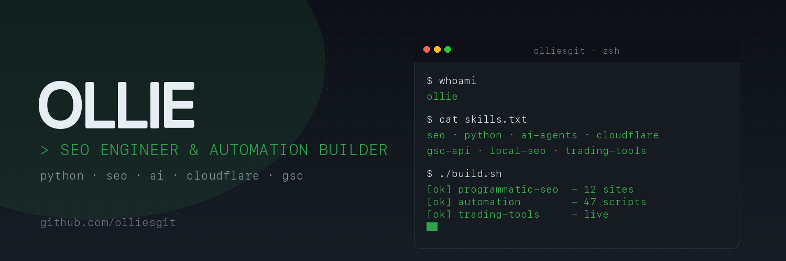

I'm an SEO engineer from Australia who builds search-friendly systems at scale - and helps clients turn them into measurable growth.

I work across programmatic SEO platforms, AI agents for content and research, and the Python tooling I’ve built to power both. Full stack when needed: Astro and Cloudflare Pages on the front end, GSC APIs and LLM integrations behind it, with CLI tools and automation in between.

The goal isn’t just better infrastructure - it’s more search visibility, more qualified traffic, and systems that help clients win.

I'm taking on selective paid projects: SEO systems, API integrations, web automation, and bug fixes. If you need help or know someone who does, send an intro to `ollie@underdog.digital`.

  
  
  
  
  
  

---

## What I build

| Area | Stack |
|---|---|
| Programmatic SEO | Python, Astro, Cloudflare Pages, GSC API, IndexNow |
| AI agents and automation | LLM APIs, multi-model orchestration, MCP servers |
| Data tooling | Scraping, OCR, image pipelines, local-first apps |
| Trading systems | Quantitative research, market scanners, ML experiments |

## Featured projects

| Project | What it does | Stack |
|---|---|---|
| [meta-nuke](https://github.com/olliesgit/meta-nuke) | Strips every trace of metadata from images. Totally cleanses them. | Python |
| [cli-ports-table](https://github.com/olliesgit/cli-ports-table) | Zero-dependency port listener for macOS, ships as a Homebrew tap | Python |
| [open-proxy-checker](https://github.com/olliesgit/open-proxy-checker) | Validates open proxies at scale with a resilient pipeline | JavaScript |
| [seo-router](https://github.com/olliesgit/seo-router) | Natural language CLI for SEO tools with Qwen routing | Python |
| [geo-tools](https://github.com/olliesgit/geo-tools) | Generative Engine Optimization toolkit for AI search visibility | Python |
| [image-smash](https://github.com/olliesgit/image-smash) | Batch image compression and conversion GUI | Python |

---

## Links

- Website: [underdog.digital](https://underdog.digital)
- Website: [trade ads](https://tradeads.online)
- X: [@ollies0x](https://x.com/ollies0x)
- Email: `ollie@underdogdigital.com.au`
